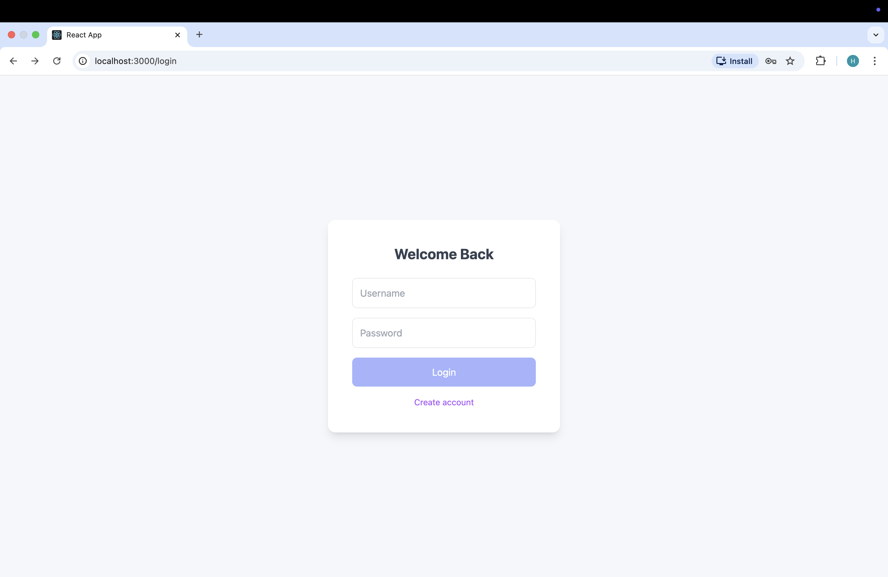
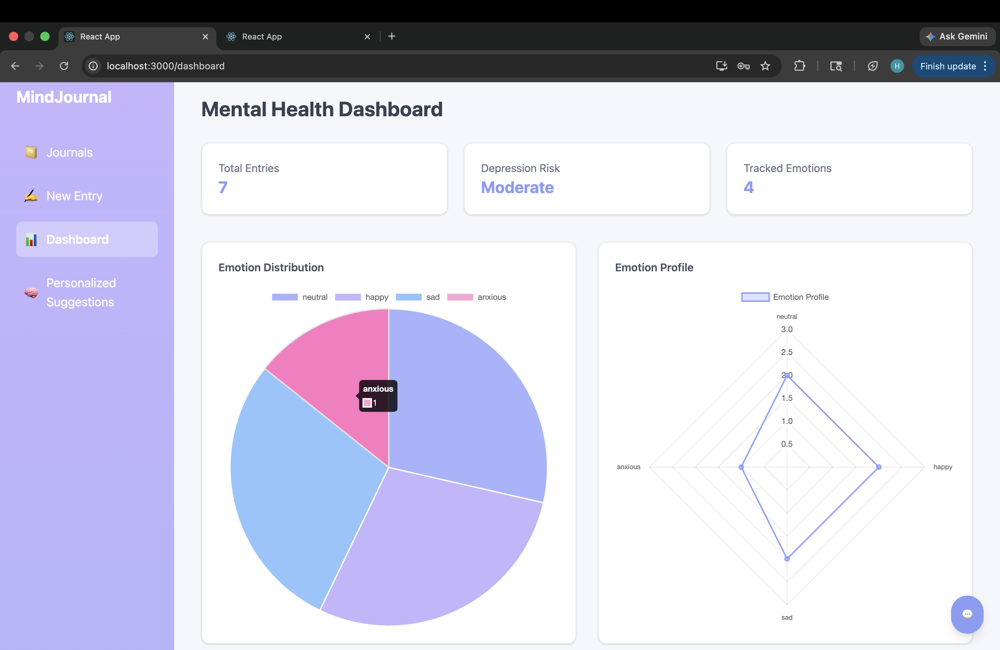
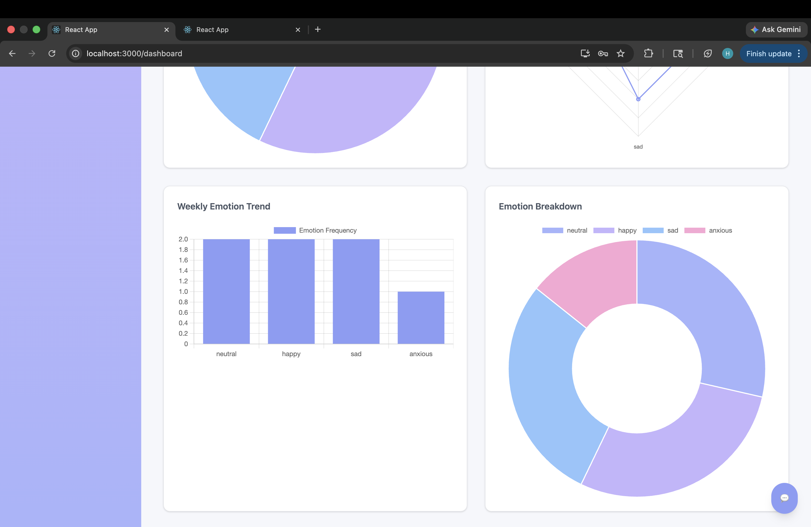
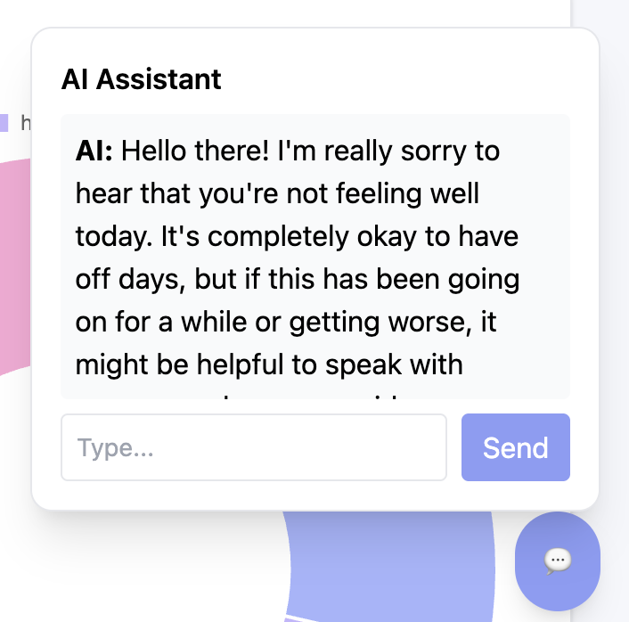
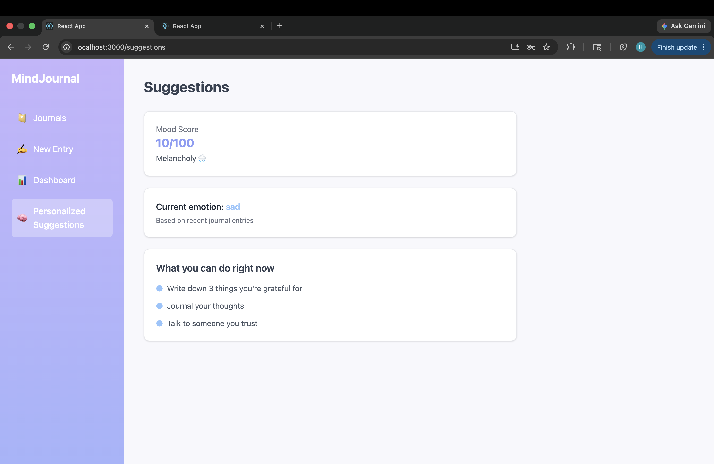

# Emotion-Aware AI Mental Wellness Platform

An AI-powered mental wellness journaling platform that uses Natural Language Processing (NLP), Machine Learning, Conversational AI, and Large Language Models (LLMs) to analyze emotions from journal entries, track mood patterns, provide personalized wellness suggestions, and offer empathetic AI-based emotional support.

The platform enables users to maintain journals, visualize emotional trends, interact with an AI chatbot, and receive actionable mental wellness recommendations based on their emotional state.

---

## Features

### 🧠 AI Emotion Detection
- Detect emotions from journal entries using NLP models
- Emotion classification using Machine Learning
- Multi-emotion probability prediction
- Real-time emotion analysis

---

### 📓 Smart Journaling System
- Write and store daily journal entries
- Persistent journal history
- Emotion-tagged journal records
- User-specific journal management

---

### 📊 Mood Analytics Dashboard
- Emotion distribution visualization
- Emotional timeline tracking
- Mood score calculation
- Depression risk estimation
- Emotional trend analysis

---

### 🤖 AI Mental Wellness Chatbot
- Conversational emotional support assistant
- Emotion-aware AI responses
- Contextual conversation history
- LLM-powered empathetic interaction using Ollama + Phi-3

---

### 🔐 Authentication System
- User signup and login
- Session-based user management
- Personalized emotional analytics

---

## Tech Stack

### Frontend
- React.js
- Tailwind CSS
- Chart.js
- Fetch API

---

### Backend
- FastAPI
- Python
- Uvicorn
- REST APIs

---

### Machine Learning & AI
- Scikit-learn
- NLP Emotion Classification Models
- Multi-label Emotion Detection
- Ollama
- Phi-3 LLM
- Prompt Engineering

---

### Database
- SQLite

---

## Project Architecture

```text
User
  ↓
React Frontend
  ↓
FastAPI Backend
  ↓
Emotion Detection Models
  ↓
SQLite Database
  ↓
Dashboard + AI Suggestions + Chatbot
  ↓
Ollama + Phi-3 LLM
```

---

# Core Functionalities

## 1. Emotion Detection Pipeline

1. User writes a journal entry
2. Text is sent to the FastAPI backend
3. NLP model processes the text
4. Emotion is predicted
5. Emotion + journal stored in database
6. Dashboard updates analytics

---

## 2. Mood Score System

The platform calculates a dynamic mood score based on recent emotional history.

### Example Score Mapping

| Emotion | Score |
|---|---|
| sad | 25 |
| anxious | 35 |
| neutral | 50 |
| happy | 85 |

The final mood score is calculated using the average of recent journal emotions.

---

## 3. Suggestion Engine(Score Based)

The suggestion system:
- Detects dominant emotional state
- Generates personalized wellness recommendations
- Provides mental wellness guidance

Example:
- Breathing exercises
- Journaling prompts
- Stress relief activities
- Productivity suggestions

---

## 4. AI Chatbot using Ollama + Phi-3

The chatbot:
- Detects emotional tone from conversation
- Maintains recent conversation context
- Uses Ollama locally for inference
- Generates empathetic responses using Phi-3 LLM
- Supports mental wellness conversations

Example:

```text
User: "I'm exhausted and anxious."

AI: "It sounds like you're carrying a lot right now. Taking a short break and focusing on one small task at a time may help reduce the overwhelm."
```

---

# Installation

## Clone Repository

```bash
git clone https://github.com/YOUR_USERNAME/emotion-ai-journal.git
cd emotion-ai-journal
```

Replace `YOUR_USERNAME` with your GitHub username.

---

# Backend Setup

Navigate to backend folder:

```bash
cd backend
```

---

## Create Virtual Environment

### Mac / Linux

```bash
python3 -m venv venv
source venv/bin/activate
```

### Windows

```bash
python -m venv venv
venv\Scripts\activate
```

---

## Install Backend Dependencies

```bash
pip install -r requirements.txt
```

---

## Install Ollama

Download and install Ollama:

### macOS / Windows

Visit:

```text
https://ollama.com/download
```

### Linux

```bash
curl -fsSL https://ollama.com/install.sh | sh
```

---

## Pull Phi-3 Model

```bash
ollama pull phi3
```

---

## Run Ollama

```bash
ollama serve
```

---

## Run Backend Server

```bash
uvicorn main:app --reload
```

Backend runs at:

```text
http://127.0.0.1:8000
```

Swagger API docs:

```text
http://127.0.0.1:8000/docs
```

---

# Frontend Setup

Open another terminal:

```bash
cd frontend
```

Install dependencies:

```bash
npm install
```

Run frontend:

```bash
npm start
```

Frontend runs at:

```text
http://localhost:3000
```

---

# Project Structure

```text
emotion-ai-journal
│
├── backend
│   ├── main.py
│   ├── database.py
│   ├── requirements.txt
│   ├── emotion_model.pkl
│   ├── vectorizer.pkl
│   ├── emotion_model_2.pkl
│   ├── emotion_vectorizer.pkl
│   ├── emotion_mlb.pkl
│   └── suggestion_model.pkl
│
├── frontend
│   ├── src
│   │   ├── components
│   │   ├── pages
│   │   ├── App.js
│   │   └── index.js
│   └── package.json
│
├── demo
│   ├── landing.png
│   ├── login.png
│   ├── dashboard1.png
│   ├── dashboard2.png
│   ├── journal.png
│   └── chatbot.png
│
└── README.md
```

---

# API Endpoints

| Endpoint | Description |
|---|---|
| `/signup` | Register user |
| `/login` | User login |
| `/journal` | Add journal entry |
| `/predict` | Predict emotion |
| `/dashboard/{user_id}` | Dashboard analytics |
| `/journals/{user_id}` | Fetch journals |
| `/suggestions/{user_id}` | Personalized suggestions |
| `/score/{user_id}` | Mood score |
| `/chat` | AI chatbot |

---

# Demo

## Landing Page


---

## Login Page


---

## Journal Entry


---

## Dashboard


---

## Analytics Dashboard


---

## AI Chatbot


---

## Suggestions


---

# Future Improvements

- Advanced transformer-based emotion models
- Mood trend forecasting
- Spotify mood-based music recommendations
- Therapist-style conversational AI
- JWT authentication
- Password hashing
- PostgreSQL integration
- Cloud deployment
- Mobile application support
- Multi-language emotion detection

---

# AI Concepts Used

- Natural Language Processing (NLP)
- Emotion Classification
- Multi-label Classification
- Sentiment Analysis
- Conversational AI
- Large Language Models (LLMs)
- Prompt Engineering
- Machine Learning Pipelines

---

# Author

Harshita Saxena